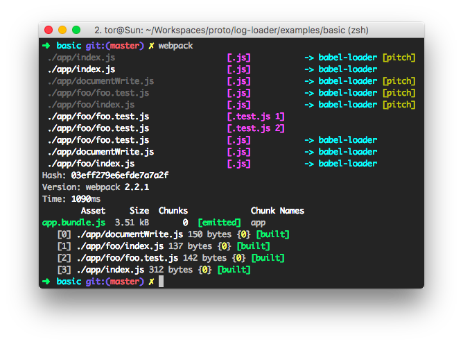

# basic



## Getting Started

To see result of the screenshot, follow next steps
```
git clone https://github.com/extg/log-loader
cd log-loader/examples/basic
npm install
node_modules/.bin/webpack
```


run build
```
npm run build
npm run server
```

for developmetn
```
npm run watch
```


**See [Proto](https://github.com/extg/proto/releases)** - it's a project that explain how webpack.config grow
